# 本地部署教程

## Step 1 — 下载软件

> 如果有软件包了请直接前往 **Step 2 — 服务共享**

在网页公告点击 **链接** 进入软件唯一发布途径，刷新或者重新进入登录界面会显示公告，链接左下角也有显示

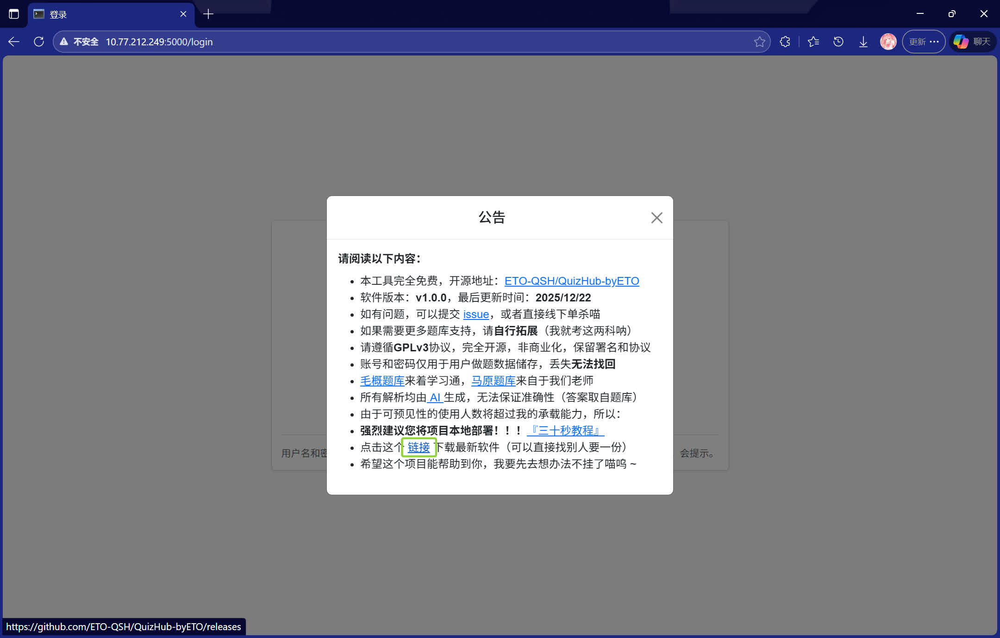

在最新的 **Releases** 里面展开 **Assets** ，然后点击 **QuizHub-byETO.exe** 下载最新软件

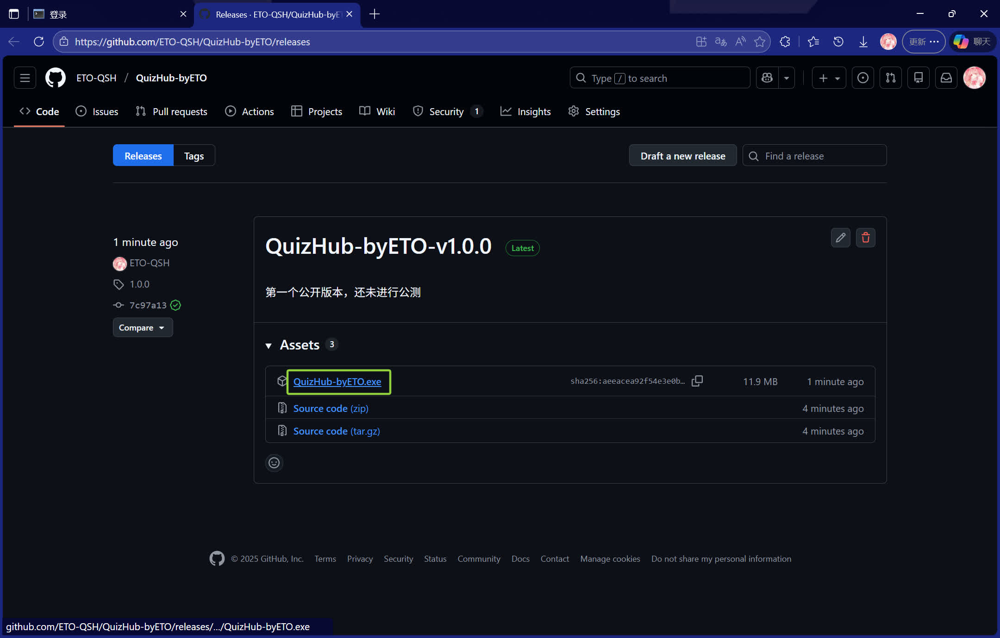

许可浏览器下载软件，核心就是问什么都答 **保留**，从 **唯一发布途径** 下载的软件绝对无害！

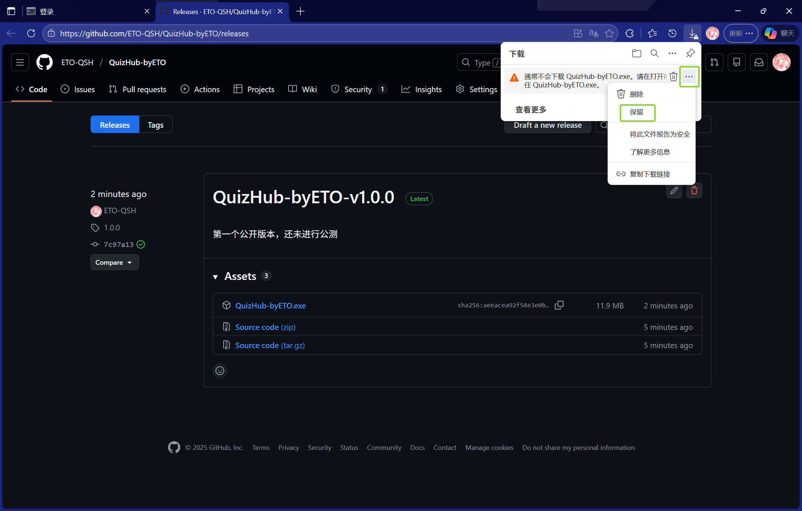
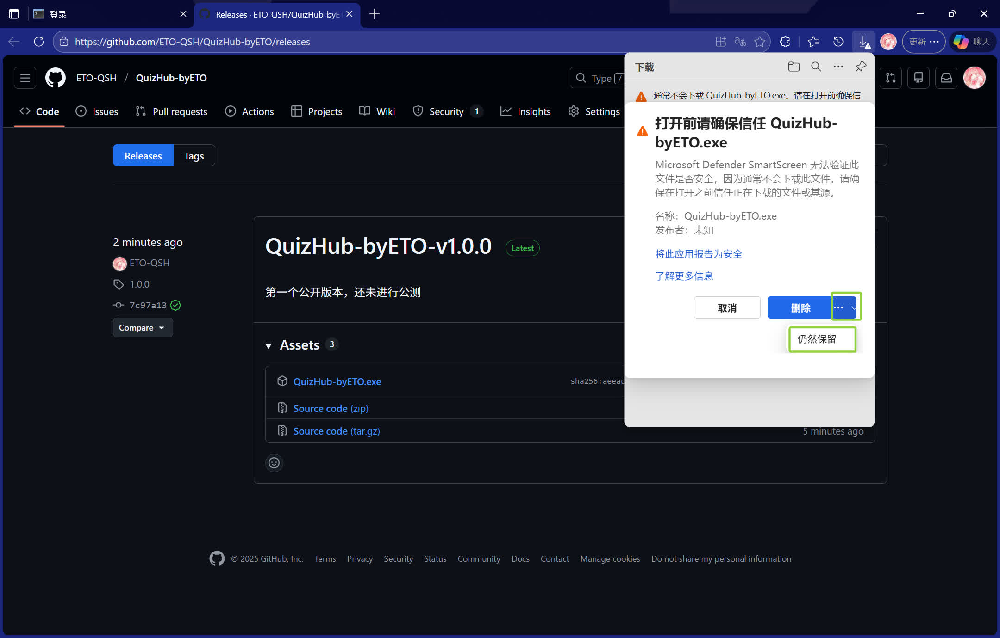

---

## Step 2 — 服务共享

在桌面新建一个文件夹，将刚下载的软件放入其中，并双击打开软件

许可计算机运行软件，核心就是问什么都答 **运行**，从 **唯一发布途径** 下载的软件绝对无害！

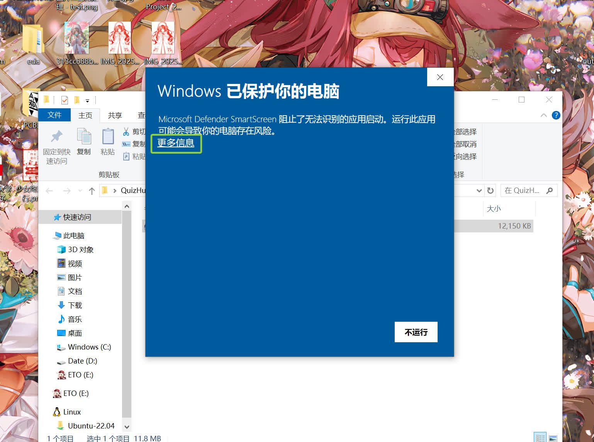
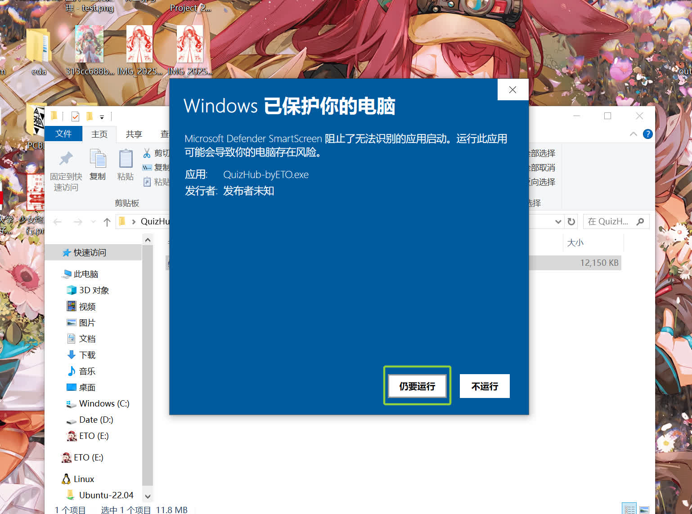

最后开启局域网共享，这样的话就可以随时在同一网络环境下面访问网页
要求是电脑作为服务端连接校园网，手机平板电脑等其他设备作为客户端页连接校园网
经过测试，四个校区的 WHUT-LSP 和 WHUT-DORM 都为同一环境
也就是南湖电脑连接 WHUT-LSP ，余家头设备可以通过连接 WHUT-DORM 访问
或者说处于同一个热点环境下。如果这一步没有共享，其他设备无法访问
如果误操作请看下面的其他说明 **Step 3 — 其他说明**

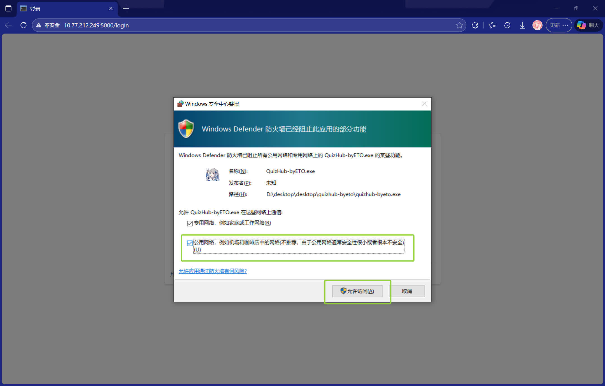

在其他的设备上面填入 **你左上角** 的地址即可访问，我这里的就是你现在访问的，你正在使用我提供的访问喵 ~

---

## Step 3 — 其他说明

### 3.1 运行日志以及关闭服务

软件打开时弹的框框是软件运行的后端日志，你对完全不重要，你只需要知道点击右上角的 **X** 就可以退出了就行

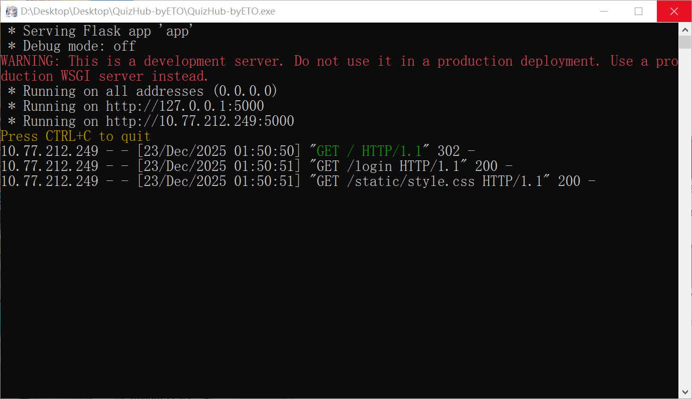

### 3.2 换设备无法访问

> 无论是误操作还是系统未弹窗，都需要再在防火墙里面进行更改，或者请检查设备是否处于同一网络环境下

**Windows 安全中心** -- **防火墙和网络保护** -- **允许应用通过防火墙**

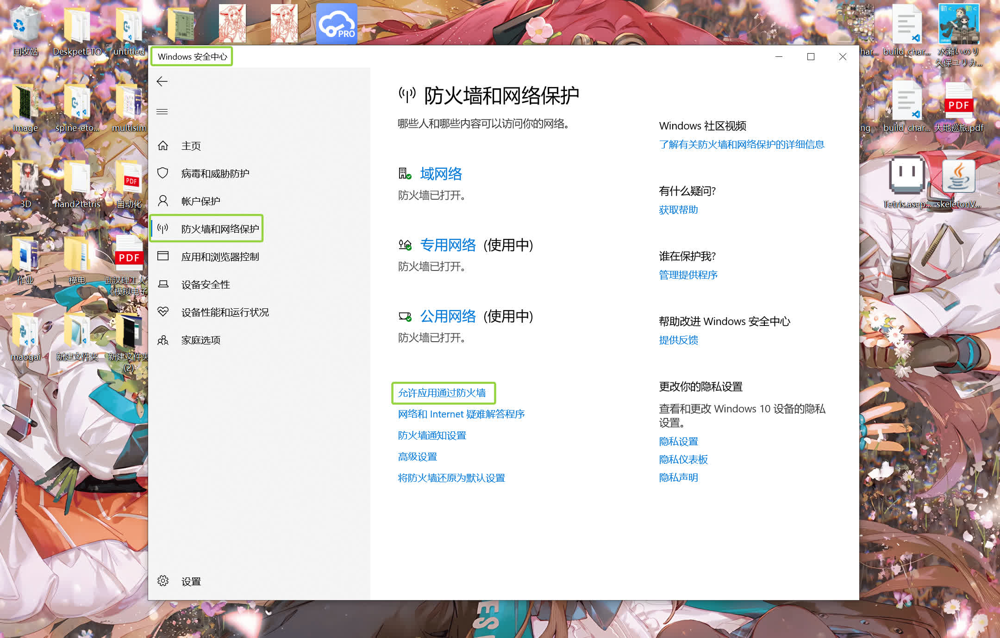

点击 **更改设置** 并在下面的列表中找到软件 **quizhub-byeto** ，三个勾都勾上然后点击下面 **确定**

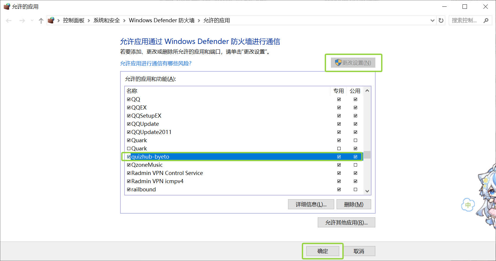

### 3.2 提示端口已被占用

> 如果是这样就说明默认的 **5000** 口已经运行了其他服务，我们需要换一下

在软件的父文件夹的 **地址栏** 点击一下，然后输入 **cmd** 回车

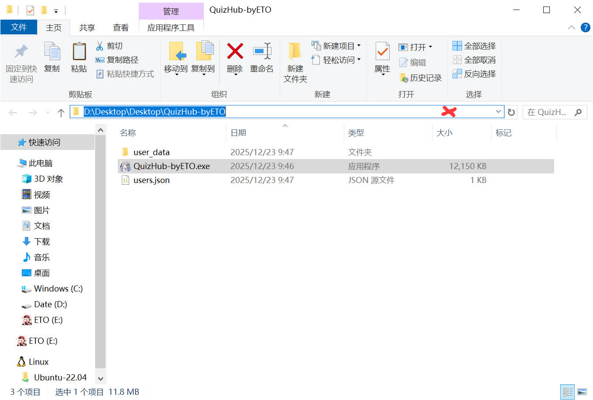
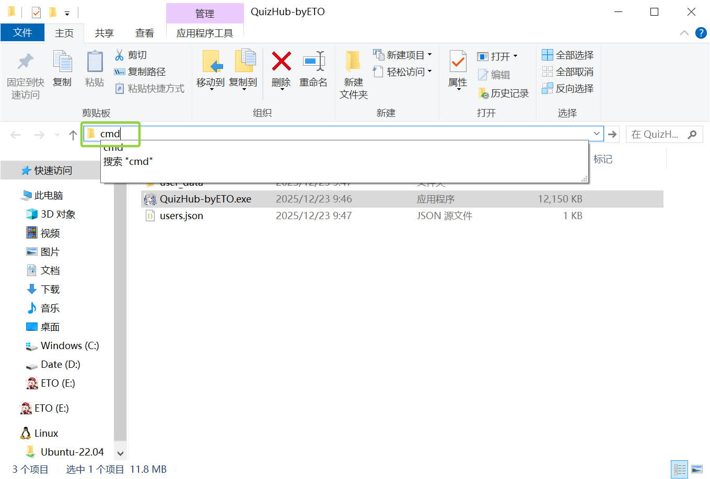

将软件拖入刚打开的黑框框中（不一定是黑的反正叫命令行）

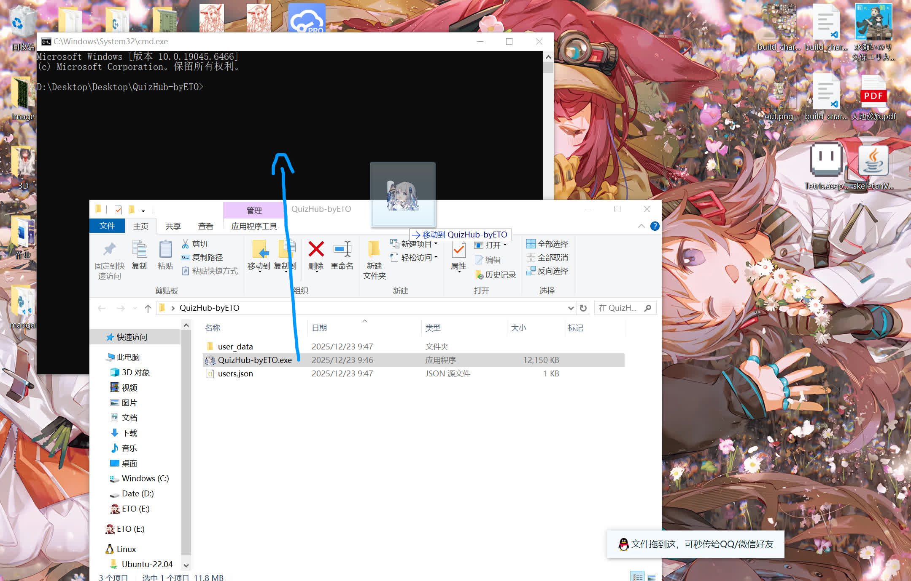

在后面输入 **空格** 加上一个新的端口数字
要求正整数不超过65535，建议直接输入5位数
若依然重复就重复拖动以及之后的操作即可

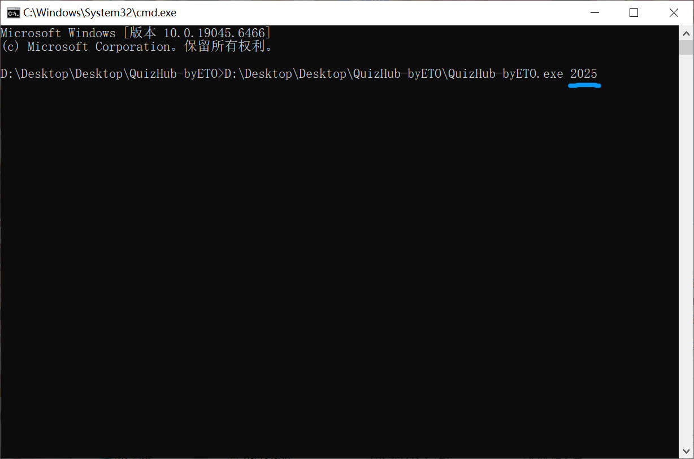

### 3.4 如遇到其他问题请提交 Issue

---

###### 本项目采用 GNU Affero General Public License v3.0 协议
